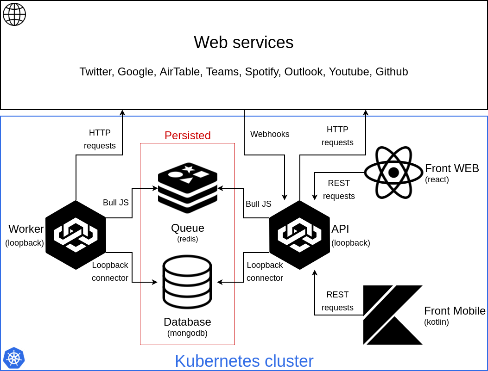

# AREA
[](http://git.b12powered.com/Eldriann/area/commits/master)
[](http://git.b12powered.com/Eldriann/area/commits/develop)

This is the repository of the area project.

# How to use

## Install
You need to install ngrok and run it to create a proxy that expose your local server on the internet.
You need to copy the `.env.example` file to a `.env` file and modify the variables as you need
(see [this](./docs/server/initialize_env.md) file for information on how to fill environment values).
The `API_URL` value should be the url given by ngrok.
The `REACT_APP_API_URL` value should be the same as `API_URL`.

## Run

**dev mode:**

```bash
// run ngrok
cp .env.example .env
// update .env
npm run install
npm run dev
```

**prod mode:**

```bash
// run ngrok
cp .env.example .env
// update .env
npm start
```

# Information

You can have more information on the development process by going into the [docs](./docs) folder.

The project is organised as follow:


The API and Worker uses the [server](./server) folder to be build.

The WEB front uses the [web](./web) folder to be build.

The Mobile front uses the [mobile](./mobile) folder to be build.

## Example

You can find a live version of this project on [https://area.b12powered.com](https://area.b12powered.com).

# Authors

* [Brian Guitteny](https://github.com/briangtn)
* [Julian Frabel](https://github.com/Eldriann)
* [Jules Bulteau](https://github.com/JBulteau)
* [Romain Fouyer](https://github.com/romanosaurus)
* [Charlie Jeanneau](https://github.com/JeSuisCharlie1)
* [Lilian Arago](https://github.com/NahisWayard)
