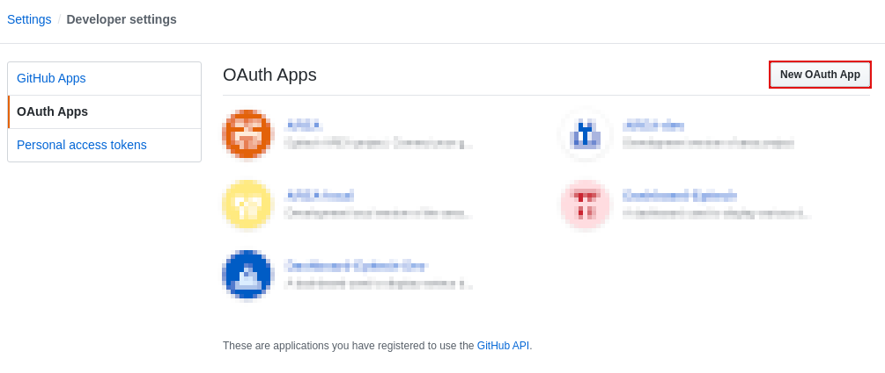
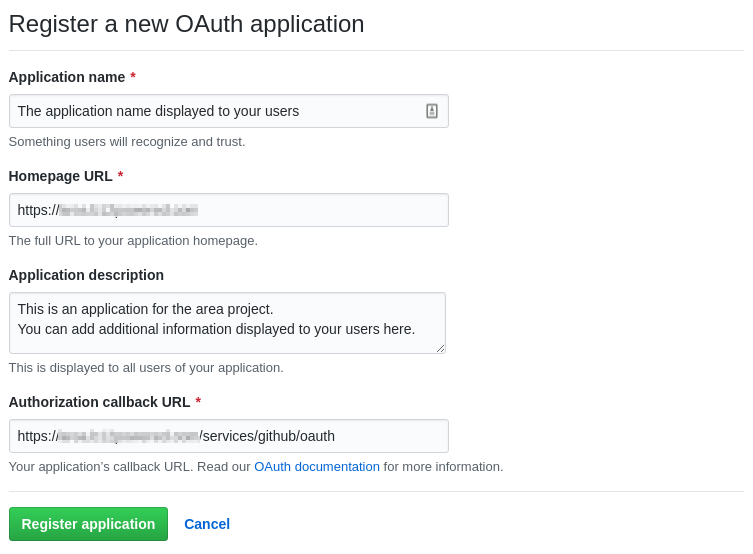
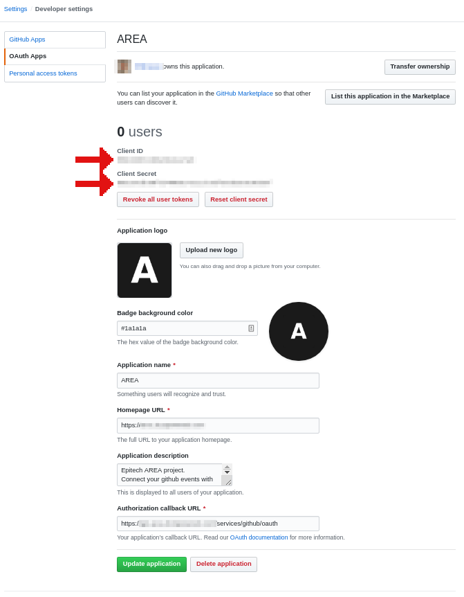

# Github setup tutorial

## Create a github application

Go to [Github apps page](https://github.com/settings/developers) then create an app by clicking the following button:

You will go to this page:

You need to fill the following fields:
* Application name: anything you want, it will be showed to your users
* Homepage URL: the url of your front end web application
* Authorization callback URL: `https://YOURAPIDOMAIN.COM/services/github/oauth`

## Get .env values

After creating the application you will need the followings data from the application page:

Use the `Client ID` field in the page for the variable `GITHUB_CLIENT_ID` in the .env file.
Use the `Client Secret` field in the page for the variable `GITHUB_CLIENT_SECRET` in the .env file.