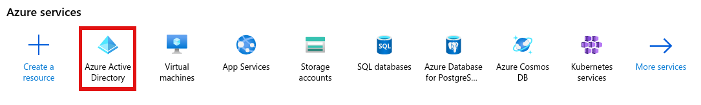
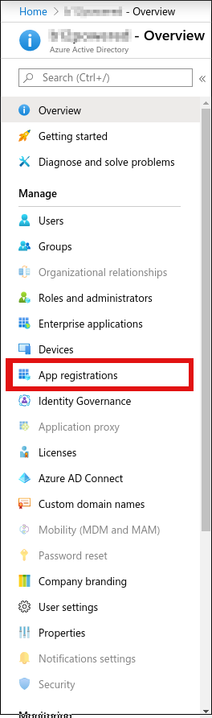
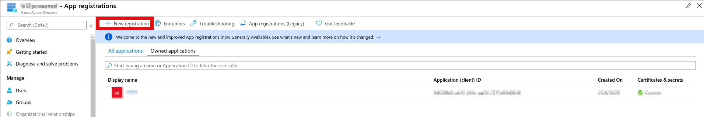
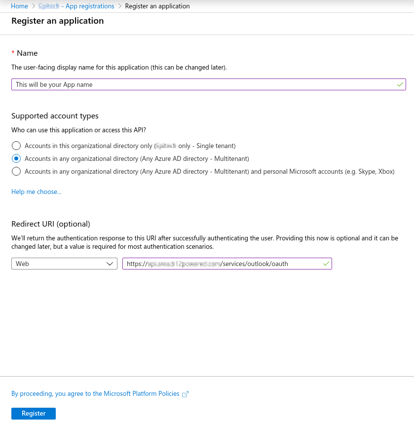
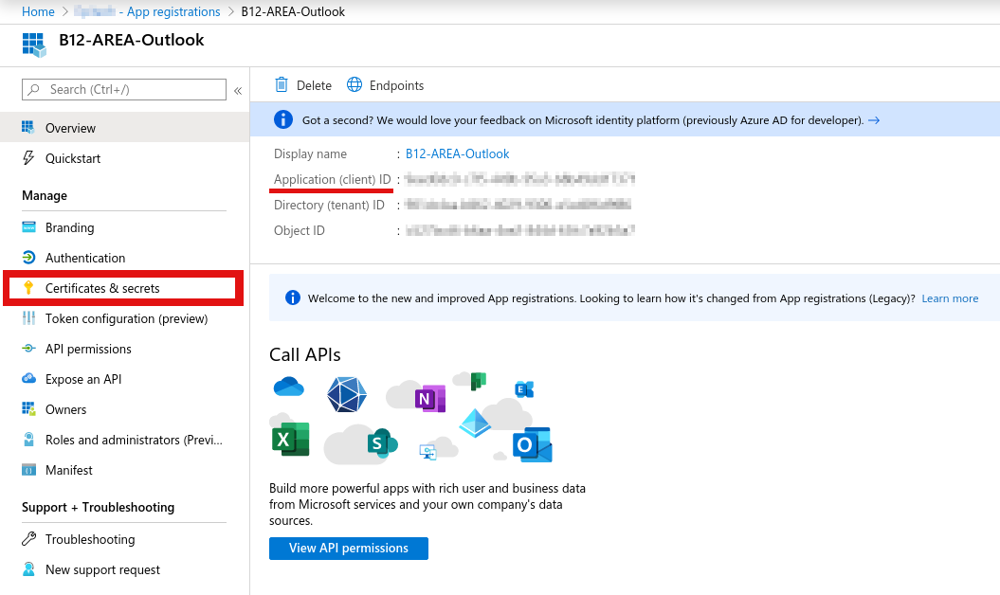
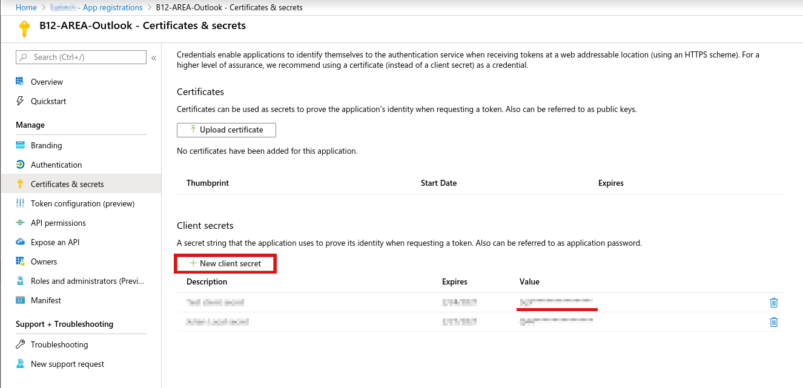
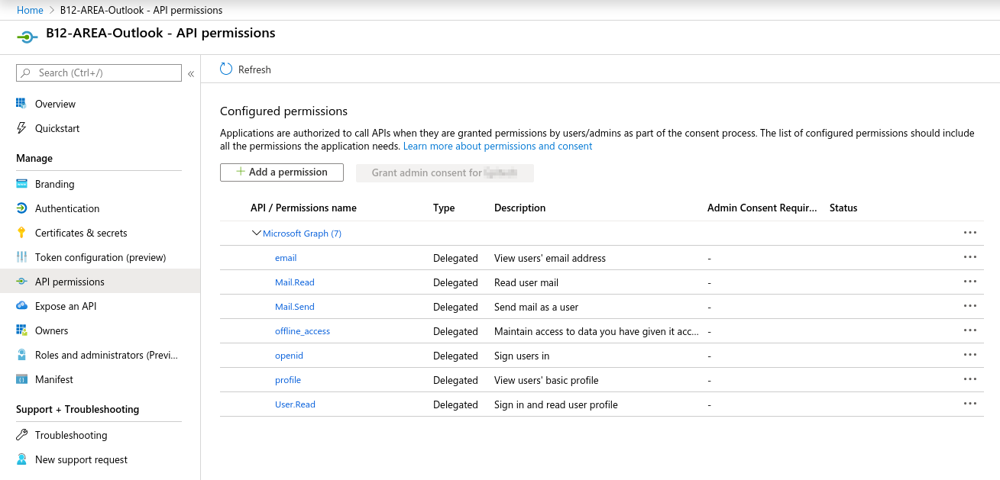

# Teams setup tutorial

## Create a azure application for teams

Go to [Azure portal page](https://portal.azure.com/) then go to `Azure Active Directory` then `App registrations`:

You can then create a new application:

In the app registration page select multitenant and enter the api redirect url (`https://YOURAPIDOMAIN.COM/services/outlook/oauth`).
You can always add new redirect url after that in the Authentication tab of the azure application.

## Get .env values

When you have an application in the azure directory you can retrieve the environment values:

In Overview you will be able to get the `OUTLOOK_CLIENT_ID` variable.
The next variable will be found in 'Certificates & secrets' tab.

In the 'Certificates & secrets' tab you will get the `OUTLOOK_CLIENT_SECRET` variable.

You need to click on the 'New client secret' button and copy the value of the new secret.

/!\ This value will be there only shortly if you refresh the page it will be hidden. /!\

The last thing to do after getting the variables is setting the application permissions, go to 'API permissions' tab and set the following permissions:

