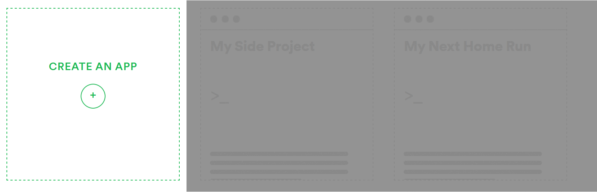

# Spotify setup tutorial

## Create a spotify application

Go to [Spotify apps page](https://developer.spotify.com/dashboard/applications) then create an app by clicking this button

Chose a name a write a description an then in `What are you building?` chose

* Mobile App
* Website

Then select your app and go in your app dashboard

click on `Edit settings` button

Then in `Redirect URIs` add:
* `https://YOURAPIDOMAIN.COM/services/spotify/oauth`

## Setup environment variables

Right now you have to setup environment variables for spotify.

All the value for the variables can be found in `Dashboard > *Your App*` (All of these variable must be setup in your `.env` file)

* `SPOTIFY_CLIENT_ID`: Client ID
* `SPOTIFY_CLIENT_SECRET`: Client Secret

