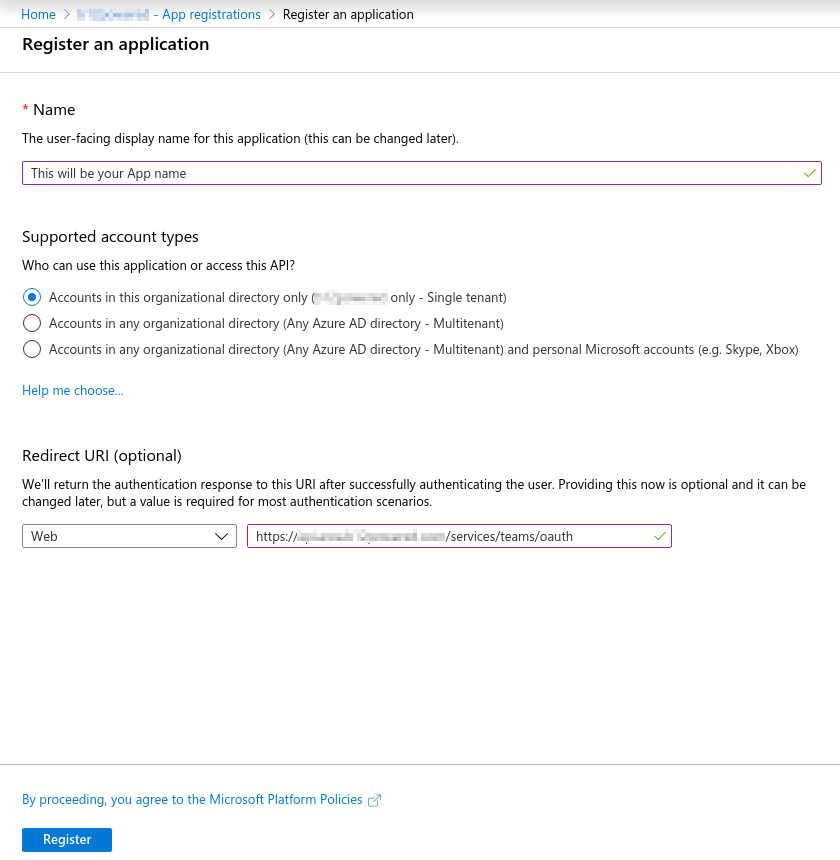
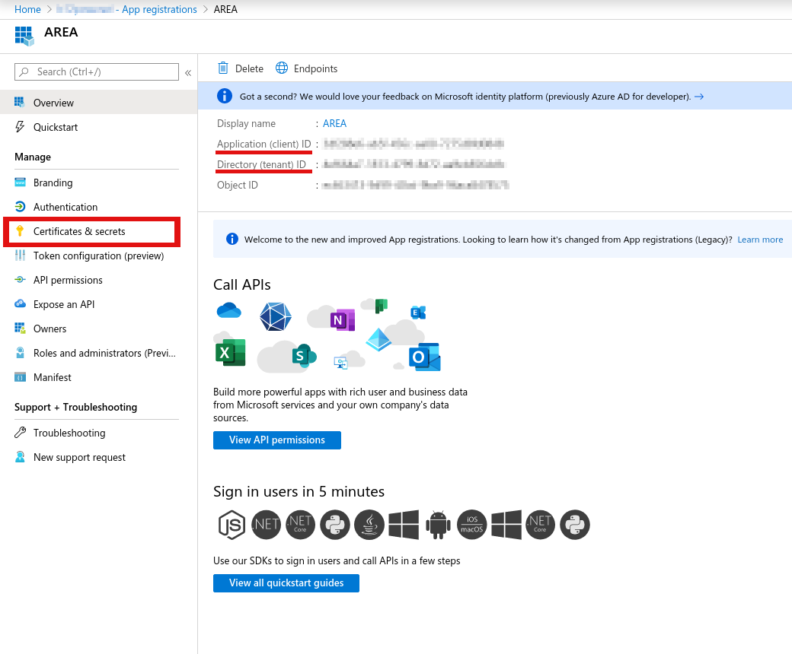
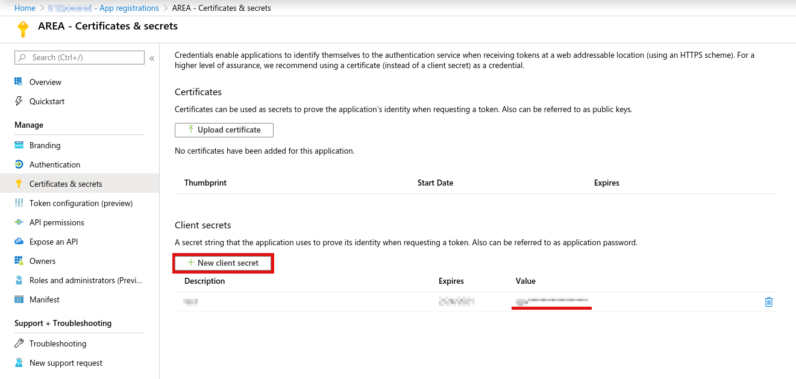

# Teams setup tutorial

## Create a azure application for teams

Go to [Azure portal page](https://portal.azure.com/) then go to `Azure Active Directory` then `App registrations`:

You can then create a new application:

In the app registration page select single tenant and enter the api redirect url (`https://YOURAPIDOMAIN.COM/services/teams/oauth`).
You can always add new redirect url after that in the Authentication tab of the azure application.

## Get .env values

When you have an application in the azure directory you can retrieve the environment values:

In Overview you will be able to get the `TEAMS_CLIENT_ID` and `TEAMS_TENANT_ID` variables.
The next variable will be found in 'Certificates & secrets' tab.

In the 'Certificates & secrets' tab you will get the `TEAMS_CLIENT_SECRET` variable.

You need to click on the 'New client secret' button and copy the value of the new secret.

/!\ This value will be there only shortly if you refresh the page it will be hidden. /!\

The last thing to do after getting the variables is setting the application permissions, go to 'API permissions' tab and set the following permissions:

/!\\
The permissions `Group.ReadWrite.All` and `User.Read.All` are required to send a message in a teams channel and retrieve a user channels.
They require an admin consent of your azure directory.
Ask your administrator to validate your application permissions before using the area application.
Once the administrator agrees to your application permissions a green checkbox will appear near the permission as in the screenshot above.
/!\\