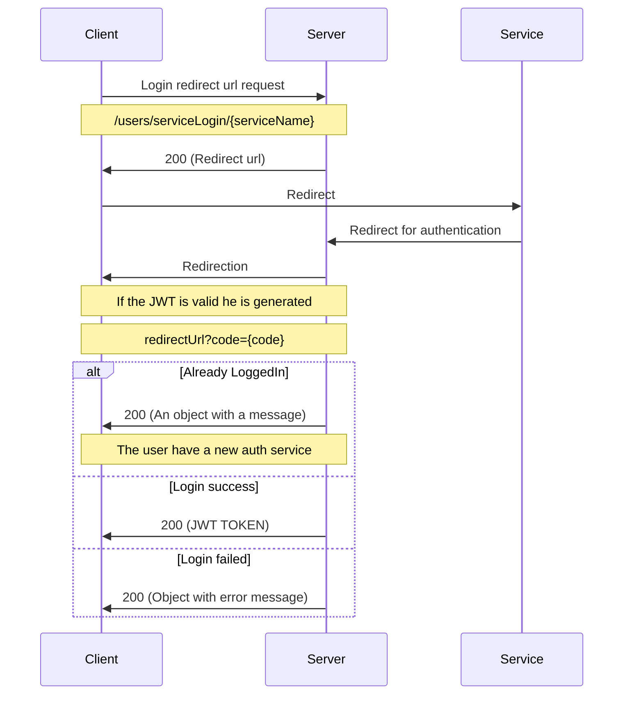

# Auth service

In this page we gonna see how to create an area authentication service.

## Get started

An authentication service is an external service for login (like Google, Twitter, ...)

### Call an auth service 📣

If you want to use the API for calling an auth service first you have to call the `GET /users/serviceLogin/{serviceName}` you must give a `redirectURL` query params.

`serviceName` must be the name of the needed authentication service in lower case. This service must exist in the called api server.

`redirectURL` is the url where your user gonna be redirected at the end of the authentication process.

In case of success this route gonna answer you something like that:

```json
{
    "url": "http://foo.bar.fr/redirect"
}
```

After that you have to redirect your user to the given url.

Then you gonna be redirected to the `redirectURL` with a `code` query params.

You can exchange this code with some data using `GET /data-code/{code}`.

This data can have three possible format

✅ *In case of success (If you didn't give a valid JWT in `Authorization` header)*
```json
{
  "token": "JWT TOKEN",
  "require2fa": false
}
```
✅ *In case of success (If you give a valid JWT in `Authorization` header)*
```json
{
  "message": "User is linked to the service",
}
```


❌*In case of error*

🔺 *The data should be formatted like that BUT if the developper does not respect the recommandation that can have any format*
```json
{
    "error": "Error occured",
    "info": {}
}
```

After that you can use your JWT Bearer token for that on each api authenticated request you must send an `Authorization` header formated like that: `Bearer JWT_TOKEN_HERE`


## Build an auth service ⚒

You must create a folder in `server/src/area-auth-services` named by your serviceName

In this folder you must create a file named `controller.ts`.

this controller need one static method name `login` and must be exported as default

```js

export default class GoogleAuthController{

    constructor() {
    }

    static async login(finalRedirect: string, ctx: Context, userID?: string) {
        
    }


}

```