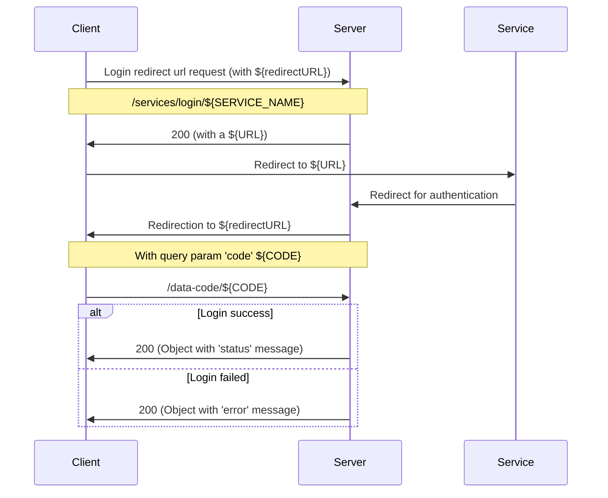
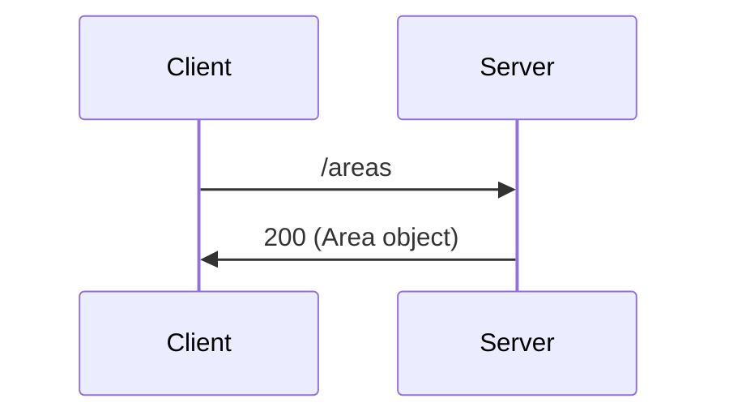
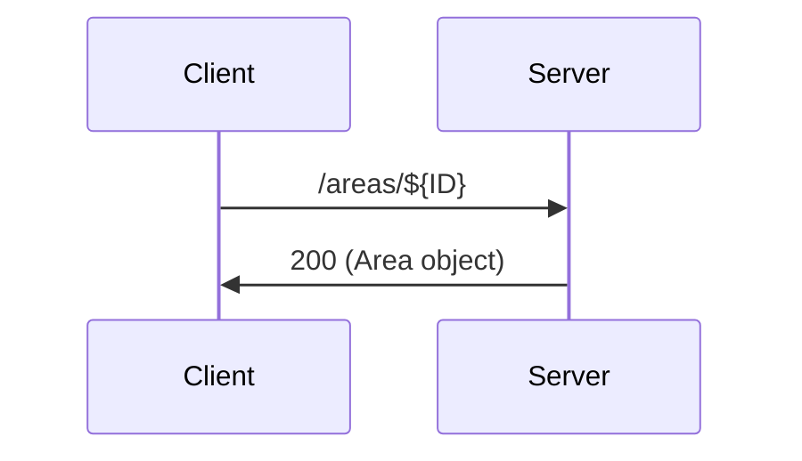
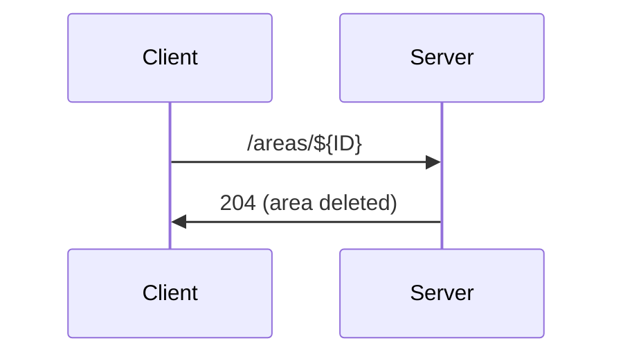
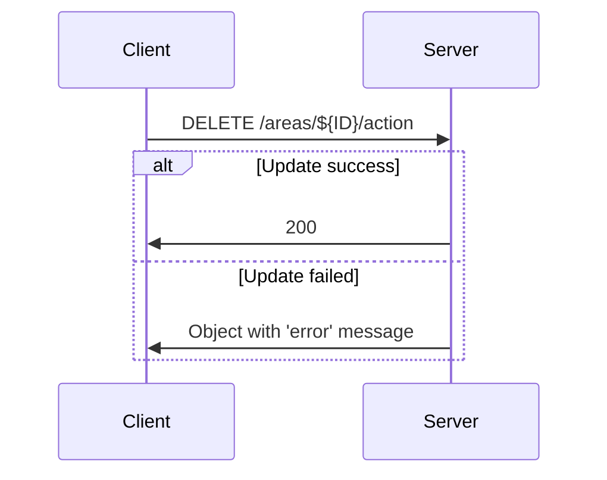
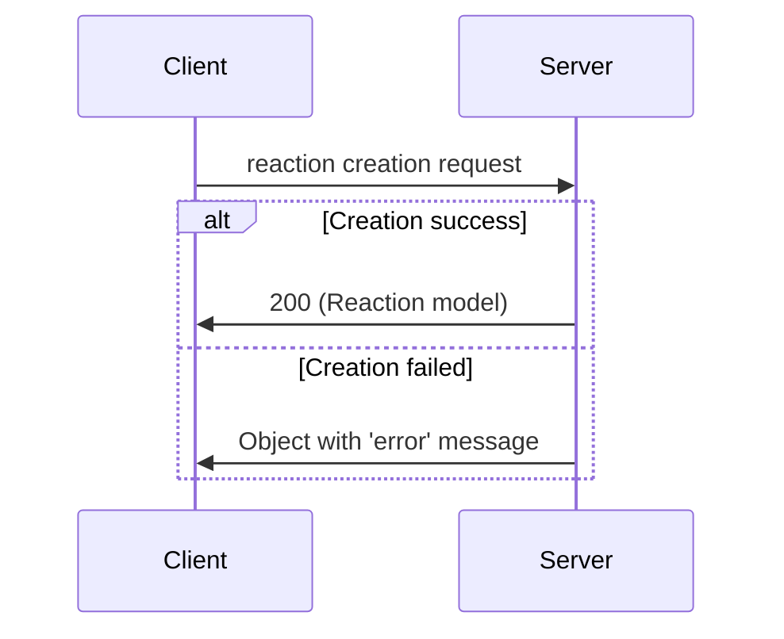
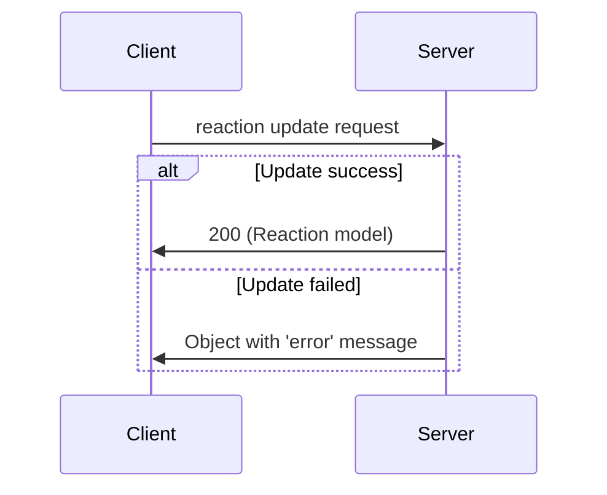
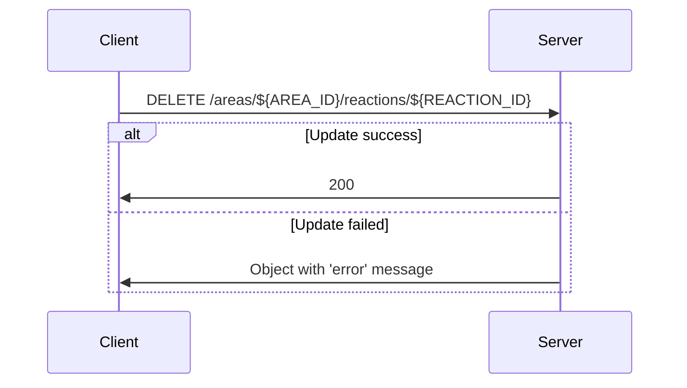

# Area and services

The following documentation is about how to create an AREA.

It will use the github service as an example but will work with any service as long as you follow the same procedure with differents parameters depending on the about.json

In all of this document anotations in the form ${XXX} will represent variables with 'XXX' beeing a descriptor of what the variable is.

In all of this document ${API_URL} correspond to the base url of the api you are contacting (ex: https://dev.api.b12powered.com).

## Table of contents
- [Area and services](#area-and-services)
  - [Table of contents](#table-of-contents)
  - [1. Services](#1-services)
    - [a. How to log in a service](#a-how-to-log-in-a-service)
  - [2. AREA](#2-area)
    - [a. How to create an AREA](#a-how-to-create-an-area)
    - [b. How to update an AREA](#b-how-to-update-an-area)
    - [c. How to delete an AREA](#c-how-to-delete-an-area)
  - [3. Actions](#3-actions)
    - [a. How to add an action to an AREA](#a-how-to-add-an-action-to-an-area)
    - [b. How to update an action of an AREA](#b-how-to-update-an-action-of-an-area)
    - [c. How to delete an action of an AREA](#c-how-to-delete-an-action-of-an-area)
  - [4. Reactions](#4-reactions)
    - [a. How to add a reaction to an AREA](#a-how-to-add-a-reaction-to-an-area)
    - [b. How to update a reaction of an AREA](#b-how-to-update-a-reaction-of-an-area)
    - [c. How to delete a reaction of an AREA](#c-how-to-delete-a-reaction-of-an-area)

## 1. Services

### a. How to log in a service

To login to a service you will need to use the routes:
```
POST ${API_URL}/services/login/${SERVICE_NAME}
GET ${API_URL}/data-code/${CODE}
```

The requests looks like this (github will be used in the examples):
```
Login redirect url request:
  request:
    format:
        url: /services/login/${SERVICE_NAME}?redirectURL=${END_REDIRECT_URL}
        body: {}
    example:
        url: /services/login/github?redirectURL=http://localhost:8080/end
        body: {}
  response:
    format:
        {
            "url": "string"
        }
    example:
        {
            "url": "https://github.com/login/oauth/authorize?client_id=XXXXXXXXXXXXXXXXXXXX&redirect_uri=https://dev.api.b12powered.com/services/github/oauth&scope=repo user&state=XXXXXXXXXXXXXXXX"
        }
```

The sequence on how to login is the following:



## 2. AREA

### a. How to create an AREA

To create an AREA you will need the following routes:
```
POST ${API_URL}/areas
```

You will need to send with the request the `name` of the AREA to create, it should be a string.

The sequence is the following:



### b. How to update an AREA

To update an AREA you will need the following routes:
```
PATCH ${API_URL}/areas/${ID}
```

You will need to send with the request the `name` that will be the new name of this area, it should be a string.

The sequence is the following:



### c. How to delete an AREA

To delete an AREA you will need the following routes:
```
DELETE ${API_URL}/areas/${ID}
```

The sequence is the following:



## 3. Actions

Only one action can be linked to an AREA at the time, trying to add more will result in an error.

### a. How to add an action to an AREA

To create an action on an AREA you will need the following routes:
```
POST ${API_URL}/areas/${ID}/action
```
with ${ID} beeing the id of the area

The requests looks like this (github will be used in the examples):
```
Action creation request:
  request:
    format:
        url: /areas/${ID}/action
        body: {
            "serviceAction": "${SERVICE_NAME}.A.${ACTION_NAME},
            "options": {} #This will depend on the action, look the about.json route to know more
        }
    example:
        url: /areas/xxxxxxxxxxxxxxxxxxxxxxxx/action
        body: {
            "serviceAction": "github.A.push,
            "options": {
                "owner": "Eldriann",
                "repo": "JFECS"
            }
        }
  response:
    format: Action model
```

The sequence is the following:


### b. How to update an action of an AREA

To update an action on an AREA you will need the following routes:
```
PATCH ${API_URL}/areas/${ID}/action
```
with ${ID} beeing the id of the area

The requests looks like this (github will be used in the examples):
```
Action update request:
  request:
    format:
        url: /areas/${ID}/action
        body: {
            "serviceAction": "${SERVICE_NAME}.A.${ACTION_NAME},
            "options": {} #This will depend on the action, look the about.json route to know more
        }
    example:
        url: /areas/xxxxxxxxxxxxxxxxxxxxxxxx/action
        body: {
            "serviceAction": "github.A.push,
            "options": {
                "owner": "Eldriann",
                "repo": "JFECS"
            }
        }
  response:
    format: Action model
```

The sequence is the following:


### c. How to delete an action of an AREA

To delete an action on an AREA you will need the following routes:
```
DELETE ${API_URL}/areas/${ID}/action
```
with ${ID} beeing the id of the area

The sequence is the following:



## 4. Reactions

One AREA can have multiple reactions.

### a. How to add a reaction to an AREA

To create a reaction on an AREA you will need the following routes:
```
POST ${API_URL}/areas/${ID}/reactions
```
with ${ID} beeing the id of the area

The requests looks like this (github will be used in the examples):
```
Reaction creation request:
  request:
    format:
        url: /areas/${ID}/reactions
        body: {
            "serviceReaction": "${SERVICE_NAME}.R.${REACTION_NAME},
            "options": {} #This will depend on the action, look the about.json route to know more
        }
    example:
        url: /areas/xxxxxxxxxxxxxxxxxxxxxxxx/reactions
        body: {
            "serviceReaction": "github.R.star,
            "options": {
                "owner": "Eldriann",
                "repo": "JFECS"
            }
        }
  response:
    format: Reaction model
```

The sequence is the following:



### b. How to update a reaction of an AREA

To update a specific reaction on an AREA you will need the following routes:
```
PATCH ${API_URL}/areas/${AREA_ID}/reactions/${REACTION_ID}
```
with ${AREA_ID} beeing the id of the area and ${REACTION_ID} the id of the reaction.

The requests looks like this (github will be used in the examples):
```
Reaction update request:
  request:
    format:
        url: /areas/${ID}/reactions/${REACTION_ID}
        body: {
            "serviceReaction": "${SERVICE_NAME}.R.${REACTION_NAME},
            "options": {} #This will depend on the action, look the about.json route to know more
        }
    example:
        url: /areas/xxxxxxxxxxxxxxxxxxxxxxxx/reactions/xxxxxxxxxxxxxxxxxxxxxxxx
        body: {
            "serviceReaction": "github.R.star,
            "options": {
                "owner": "Eldriann",
                "repo": "JFECS"
            }
        }
  response:
    format: Reaction model
```

The sequence is the following:



### c. How to delete a reaction of an AREA

To delete a reaction of an AREA you will need the following routes:
```
DELETE ${API_URL}/areas/${AREA_ID}/reactions/${REACTION_ID}
```
with ${AREA_ID} beeing the id of the area and ${REACTION_ID} the id of the reaction.

The sequence is the following:


